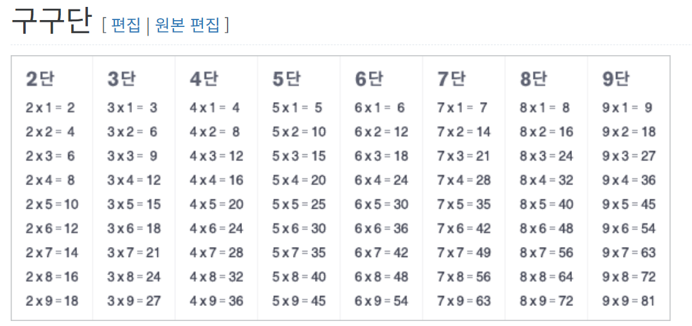

## 5. 제어문

### 중첩 for문 실습 예제 : 구구단

### 중첩 for문 실습 예제 : 별

       
## [☕🍵🥤 음료 주문 프로그램 요구사항 정의서]
### 1. 개요
- 프로그램 명: 음료 주문 시스템
- 개발 언어: Java (콘솔 기반)
- 목적: 사용자가 메뉴를 확인하고, 원하는 음료를 선택하여 주문 및 결제를 할 수 있도록 하는 시스템을 구현한다.

### 2. 기능 요구사항
#### 2.1 메뉴 출력 기능
- 시스템은 실행 시 기본 음료 메뉴를 화면에 출력한다.
- 각 메뉴는 메뉴 번호, 음료명, 가격 정보를 포함한다.

=== 메뉴판 ===
1. ☕ 아메리카노 - 2,800원
2. 🍵 바닐라 라떼 - 3,500원
3. 🥤 딸기 쉐이크 - 4,000원

#### 2.2 음료 주문 기능
- 사용자가 메뉴 번호를 입력하면 해당 음료를 선택한 것으로 간주한다.
- 메뉴판에 없는 메뉴 주문시 "준비중 입니다"라는 메시지를 출력하고, 다시 메뉴를 선택하도록 유도한다.
- 메뉴 선택 완료 시 주문 메뉴와 금액을 출력한다.

#### 2.3 결제 기능
- 주문 금액을 기반으로 결제를 진행한다.
- 사용자로부터 결제 금액(현금)을 입력받는다.
- 결제 금액이 부족할 경우: “금액이 부족합니다. 다시 입력해주세요.” 라는 메시지를 출력하고 결제 금액(현금)을 입력받도록 유도한다.
- 결제 금액이 충분할 경우: 결제 완료 메시지와 잔돈을 출력한다.

#### 2.4 예외 처리 기능
메뉴 번호나, 금액이 잘못 입력될 경우(숫자가 아닐 때 등) 오류 메시지("올바르지 않은 입력값 입니다.")를 출력하고 재입력을 유도한다.

#### 2.5 프로그램 종료
주문 및 결제가 완료되면 “이용해주셔서 감사합니다.” 메시지 출력 후 프로그램 종료

### 3. 비기능 요구사항
콘솔 기반 UI로 구현

### 4. 출력 결과 시나리오
 
[시작]  
=== 메뉴판 === 
1. ☕ 아메리카노 - 2,800원 
2. 🍵 바닐라 라떼 - 3,500원 
3. 🥤 딸기 쉐이크 - 4,000원 
 
주문할 메뉴 번호 입력> 1 
=> 주문 메뉴 : ☕ 아메리카노, 결제 예정 금액 : 2,800원 
 
결제할 금액 입력> 1000 
총 입금 금액 : 1000 
=> 금액이 부족합니다. 다시 입력해주세요. 
 
결제할 금액 입력> 2000 
총 입금 금액 : 3000 
=> 결제 완료! 잔돈: 200원 
 
[종료] 
이용해주셔서 감사합니다.

